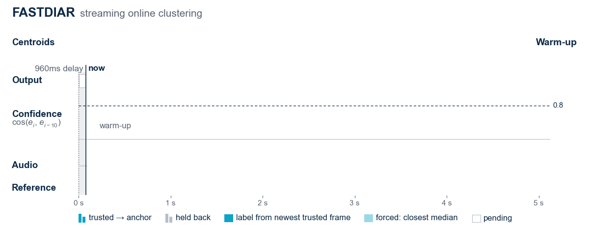

# FASTDIAR: Frame-Level Speaker Encoder for Streaming Diarization

<p align="center">
  
</p>

FASTDIAR is a streaming diarization architecture with a confidence-gated online clustering at a fixed 960 ms delay, which is the most accurate streaming diarizer on low-overlap benchmarks, degrades far less than cache-based systems beyond four speakers, and needs no diarization corpus in training.

This repository provides:
- **Pre-trained checkpoints** of the streaming encoder in three configurations;
- **Inference code**: streaming diarization to RTTM, per-frame speaker embeddings, and a live demo;
- **Benchmarking scripts**: DER on six diarization benchmarks, VoxCeleb1 EER and real-time factor
  ([fastdiar/test](fastdiar/test/README.md));
- **Training code**: distillation of the streaming encoder from ReDimNet2 b6
  ([fastdiar/train](fastdiar/train/README.md)).

## Installation

Clone the repository and install it with its pinned dependencies (Python 3.10 or newer):

```bash
git clone https://github.com/microsoft/fastdiar.git
cd fastdiar
pip install -e .
```

This installs the `fastdiar` package and three commands: `fastdiar-diarize`, `fastdiar-embed` and
`fastdiar-demo`.

<details>
<summary>FFmpeg and GPU setup</summary>

Audio decoding (`torchaudio` via `torchcodec`) needs FFmpeg on the system, e.g. `apt install ffmpeg`.

The encoder runs on a GPU when one is available. The pinned `torch`, `torchaudio` and `torchcodec`
wheels on PyPI are built for CUDA 13, which needs an NVIDIA driver 580 or newer; with an older
driver, install the CUDA 12.6 builds of the same versions:

```bash
pip install torch==2.13.0 torchaudio==2.11.0 torchcodec==0.15.0 \
    --index-url https://download.pytorch.org/whl/cu126
```

</details>

### Checkpoints

The checkpoints are attached to the [GitHub release](https://github.com/microsoft/fastdiar/releases/tag/v0.1.0)
and downloaded to the torch hub cache (`~/.cache/torch/hub/checkpoints`) the first time a model is
used. `-m` picks a released model by size, or takes a local `.pt` checkpoint file.

| Model (`-m`) | Checkpoint | Parameters |
| --- | --- | --- |
| `small` | [`fastdiar-small-90be5da5.pt`](https://github.com/microsoft/fastdiar/releases/download/v0.1.0/fastdiar-small-90be5da5.pt) | 2.4 M |
| `medium` | [`fastdiar-medium-32df7509.pt`](https://github.com/microsoft/fastdiar/releases/download/v0.1.0/fastdiar-medium-32df7509.pt) | 4.6 M |
| `large` (default) | [`fastdiar-large-f6d71444.pt`](https://github.com/microsoft/fastdiar/releases/download/v0.1.0/fastdiar-large-f6d71444.pt) | 10.4 M |

Each checkpoint holds the model's config and weights (`{"model_config": ..., "state_dict": ...}`).

## Usage

`fastdiar-diarize` and `fastdiar-embed` accept an audio file or a directory, searched recursively
for `--ext` files (default `.wav`). Audio is converted to 16 kHz mono on load. Without `-o` the
output is saved next to each audio file; with `-o DIR` it goes to `DIR`, mirroring the input's
subdirectories.

The encoder runs on a GPU when one is available, in bfloat16 (`--device cpu` to force the CPU);
the VAD and the clustering always run on the CPU.

### Diarization

```bash
fastdiar-diarize audio.wav                  # -> audio.rttm
fastdiar-diarize audio.wav -o out/result.rttm
fastdiar-diarize data/ --ext .flac -o rttm/ -m small
fastdiar-diarize data/ -o rttm/ --shift-sec 0.32
```

The audio is processed as a stream, in `--shift-sec` steps, and every speaker turn is written in the
RTTM format of pyannote. The step only sets how often results are produced, not their value, so by
default it is the fastest for the device: 60 s on a GPU, which small steps leave mostly idle, and
320 ms on the CPU, where long blocks are slower:

```
SPEAKER audio 1 0.160 6.800 <NA> <NA> spk1 <NA> <NA>
SPEAKER audio 1 6.960 4.080 <NA> <NA> spk2 <NA> <NA>
```

### Speaker embeddings

```bash
fastdiar-embed audio.wav                    # -> audio.npy
fastdiar-embed audio.wav --shift-sec 0.32   # feed the encoder in 320 ms blocks
fastdiar-embed data/ -o emb/ -m medium
```

Each `.npy` file holds a float16 `(n_frames, 192)` matrix of L2-normalized embeddings, one per 80 ms
frame. The file is fed to the causal encoder in `--shift-sec` blocks, as the diarizer does (by
default 60 s on a GPU and 320 ms on the CPU), with the same result up to rounding.

### Demo

```bash
fastdiar-demo                   # http://127.0.0.1:7860
fastdiar-demo -m small --share
```

A Gradio page that diarizes an uploaded file (played back at real-time pace) or the microphone as a
live stream. The waveform is colored by speaker as the labels are finalized, about one second
behind the audio, and can be scrolled back; **Stop** offers the RTTM for download.

Run any command with `--help` for all its options. Without installing the package, the same tools
run from the repository as `python -m fastdiar.run_diarizer`, `python -m fastdiar.run_encoder` and
`python -m fastdiar.app`.

### Python

```python
from fastdiar.cli import load_audio
from fastdiar.diarizer import StreamingDiarizer
from fastdiar.encoder import load_streaming_model

model = load_streaming_model("large")  # or a local checkpoint file; device="cuda": bfloat16 GPU
diarizer = StreamingDiarizer(model)  # step: 60 s on a GPU, 0.32 s on the CPU

rttm = diarizer(load_audio("audio.wav"), uri="audio")  # a whole file

diarizer = StreamingDiarizer(model, shift_sec=0.32)  # a live stream: 16 kHz chunks of any length
for chunk in chunks:
    for start, end, speaker in diarizer.push(chunk):
        print(f"{start:.2f}-{end:.2f} spk{speaker}")
turns = diarizer.finish()
```

### torch.hub

The models and the diarizer can also be loaded with torch hub, without installing the package
(its dependencies still have to be installed):

```python
import torch

model = torch.hub.load("microsoft/fastdiar", "large")  # also "small", "medium"
diarizer = torch.hub.load("microsoft/fastdiar", "diarizer", size="small")
```

## Evaluation and benchmarking

See [fastdiar/test/README.md](fastdiar/test/README.md): the datasets and how to compute DER, the
VoxCeleb1 speaker-verification EER, and the real-time factor.

## Training

See [fastdiar/train/README.md](fastdiar/train/README.md): downloading and preparing the data,
the training config, and the training command.

## Contributing

This project welcomes contributions and suggestions.  Most contributions require you to agree to a
Contributor License Agreement (CLA) declaring that you have the right to, and actually do, grant us
the rights to use your contribution. For details, visit [Contributor License Agreements](https://cla.opensource.microsoft.com).

When you submit a pull request, a CLA bot will automatically determine whether you need to provide
a CLA and decorate the PR appropriately (e.g., status check, comment). Simply follow the instructions
provided by the bot. You will only need to do this once across all repos using our CLA.

This project has adopted the [Microsoft Open Source Code of Conduct](https://opensource.microsoft.com/codeofconduct/).
For more information see the [Code of Conduct FAQ](https://opensource.microsoft.com/codeofconduct/faq/) or
contact [opencode@microsoft.com](mailto:opencode@microsoft.com) with any additional questions or comments.

## Trademarks

This project may contain trademarks or logos for projects, products, or services. Authorized use of Microsoft
trademarks or logos is subject to and must follow
[Microsoft's Trademark & Brand Guidelines](https://www.microsoft.com/legal/intellectualproperty/trademarks/usage/general).
Use of Microsoft trademarks or logos in modified versions of this project must not cause confusion or imply Microsoft sponsorship.
Any use of third-party trademarks or logos are subject to those third-party's policies.
