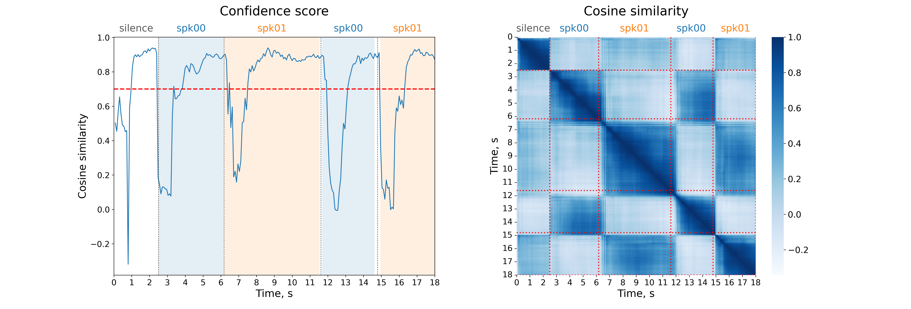
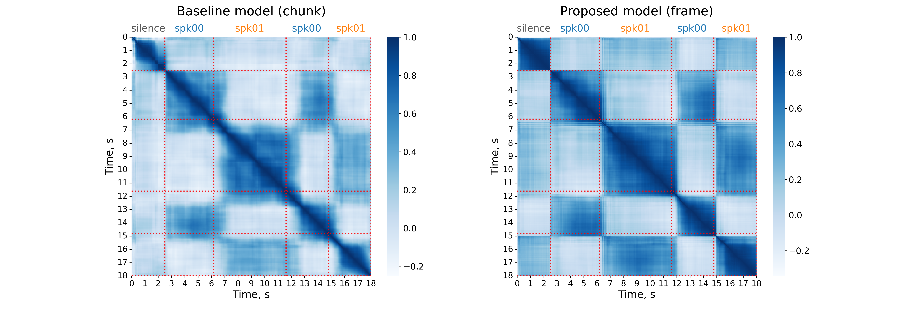

---
---

  <h1>FASTDIAR: Frame-Level Speaker Encoder for Streaming Diarization</h1>

  <!-- badges (placeholder links: replace before release) -->
  

    
    
    
  

  <!-- authors -->
  

    

      <a href="https://herimor.github.io">Nikita Torgashov1,*</a>
      <a href="https://okankop.github.io">Okan Köpüklü2</a>
    

    
1Department of Speech, Music and Hearing, KTH Royal Institute of Technology, Stockholm, Sweden

    
2Microsoft, Munich, Germany

    
*Work done during an internship at Microsoft.

  

  <figure>
    
  </figure>

  <!-- overview -->
  <h2>Overview</h2>
  

    FASTDIAR is a streaming diarization architecture with a confidence-gated online clustering at a fixed 960 ms delay, which is the most accurate streaming diarizer on low-overlap benchmarks, degrades far less than cache-based systems beyond four speakers, and needs no diarization corpus in training.
  

  <ul>
    <li><b>Frame-level streaming encoder</b>: A state-of-the-art speaker recognition model, ReDimNet2, made causal and stripped of temporal pooling. It reads the audio stream once and emits a speaker embedding every <b>80 ms</b> from a bounded two-second window of past audio, with no chunking and no recomputation.</li>
    <li><b>Confidence-gated clustering</b>: The similarity between each embedding and the one 800 ms earlier decides which frames may update a speaker centroid, so frames that straddle a speaker change never pull two clusters together. Every label leaves the system at a fixed <b>960 ms</b> delay.</li>
    <li><b>Fast on CPU</b>: With <b>10.4M</b> parameters, the full system (encoder, VAD and clustering) runs <b>5×</b> faster than real time on a single CPU thread.</li>
  </ul>

  <!-- results -->
  <h2>Results</h2>
  

    Diarization error rate (DER, %) with a collar of 0 and overlapped speech excluded, split by the number of speakers. Streaming Sortformer is capped at four speakers, so the three corpora that cross that boundary are also split at it. RTF is measured on one CPU thread. Bold marks the lowest DER in each column.
  

  

  <table class="results">
    <thead>
      <tr>
        <th rowspan="2" class="model">Model</th>
        <th rowspan="2">#Params</th>
        <th rowspan="2">Latency (ms)</th>
        <th rowspan="2">RTF</th>
        <th colspan="3" class="dataset g">NOTSOFAR</th>
        <th colspan="3" class="dataset g">VoxConverse</th>
        <th colspan="3" class="dataset g">DIHARD3</th>
        <th class="dataset g">AMI</th>
        <th class="dataset g">RAMC</th>
      </tr>
      <tr>
        <th class="g">≤4</th><th>≥5</th><th>all</th>
        <th class="g">≤4</th><th>≥5</th><th>all</th>
        <th class="g">≤4</th><th>≥5</th><th>all</th>
        <th class="g">3–4</th>
        <th class="g">2</th>
      </tr>
    </thead>
    <tbody>
      <tr>
        <td class="model">diart</td>
        <td>5.8M</td><td>1000</td><td>0.16</td>
        <td class="g">42.56</td><td>54.16</td><td>48.01</td>
        <td class="g">12.81</td><td>17.17</td><td>16.12</td>
        <td class="g">17.40</td><td>46.14</td><td>22.04</td>
        <td class="g">28.79</td>
        <td class="g">25.87</td>
      </tr>
      <tr>
        <td class="model">Streaming Sortformer</td>
        <td>117.7M</td><td>1040</td><td>1.54</td>
        <td class="g"><strong>14.48</strong></td><td>33.45</td><td>23.39</td>
        <td class="g"><strong>5.41</strong></td><td>23.55</td><td>19.15</td>
        <td class="g"><strong>14.08</strong></td><td>34.25</td><td><strong>17.34</strong></td>
        <td class="g">25.56</td>
        <td class="g">25.27</td>
      </tr>
      <tr class="ours">
        <td class="model"><b>FASTDIAR</b></td>
        <td>10.4M</td><td>960</td><td>0.19</td>
        <td class="g">19.23</td><td><strong>24.25</strong></td><td><strong>21.58</strong></td>
        <td class="g">10.70</td><td><strong>12.88</strong></td><td><strong>12.35</strong></td>
        <td class="g">24.73</td><td><strong>32.95</strong></td><td>26.06</td>
        <td class="g"><strong>22.15</strong></td>
        <td class="g"><strong>21.61</strong></td>
      </tr>
    </tbody>
  </table>
  

  <!-- ablations -->
  <h2>Ablations</h2>

  <h3>Confidence score detects cluster borders</h3>
  <figure>
    
    <figcaption>
      Left: the confidence score, the cosine similarity between the current embedding and the one 10 frames (800 ms) earlier. Right: cosine similarity between all pairs of frames of the same excerpt. Reference speakers are shown on top, and dotted lines mark reference speaker changes.
    </figcaption>
  </figure>
  

    The confidence score collapses at every speaker change and recovers once the encoder has gathered enough context from the new speaker. Its dips line up with the block borders of the similarity matrix, so the score marks where one cluster ends and the next begins, without needing any centroid or label. Frames below the threshold (dashed line) are still labeled, but only confident frames update a speaker centroid, so embeddings from a speaker change never blur two clusters together.
  

  <h3>Frame-level encoder forms sharper clusters</h3>
  <figure>
    
    <figcaption>
      Frame-to-frame cosine similarity of the same excerpt. Left: the baseline, offline ReDimNet2-B6 run on 2-second chunks with an 80 ms shift to simulate streaming. Right: the proposed frame-level encoder.
    </figcaption>
  </figure>
  

    Both encoders see the same two seconds of past audio and emit an embedding every 80 ms. The cluster borders of the baseline are blurred, while the proposed encoder forms sharp, well-separated clusters, which improves diarization quality. With the same VAD and clustering, DER drops from 14.79% to 12.35% on VoxConverse and from 27.97% to 21.61% on RAMC, and the system runs 25× faster.
  

  <!-- citation -->
  <h2>Citation</h2>

<pre class="bibtex">@article{torgashov2026fastdiar,
  title={{FASTDIAR}: Frame-Level Speaker Encoder for Streaming Diarization},
  author={Torgashov, Nikita and K{\"o}p{\"u}kl{\"u}, Okan},
  journal={arXiv preprint arXiv:XXXX.XXXXX},
  year={2026}
}</pre>


